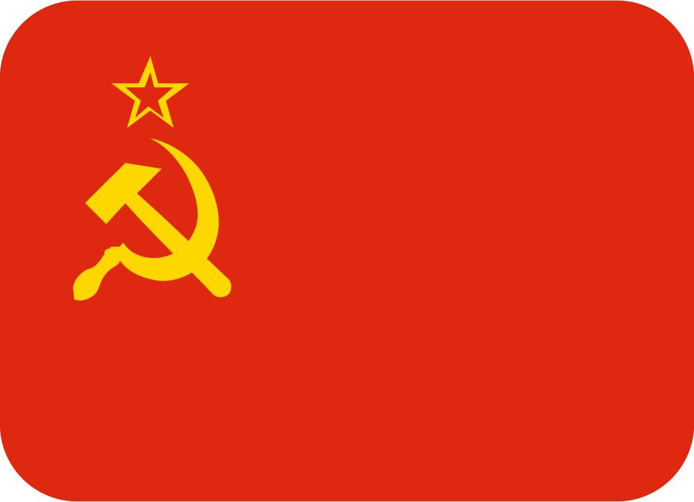
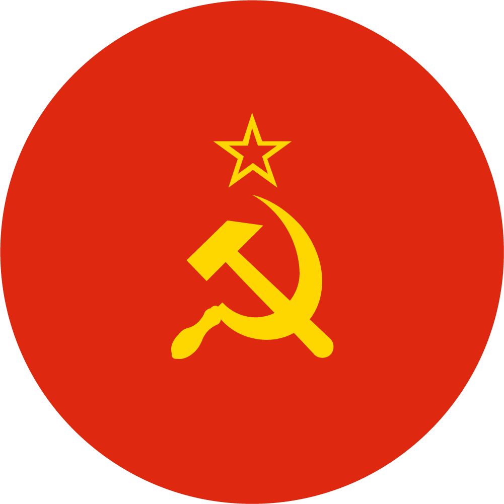
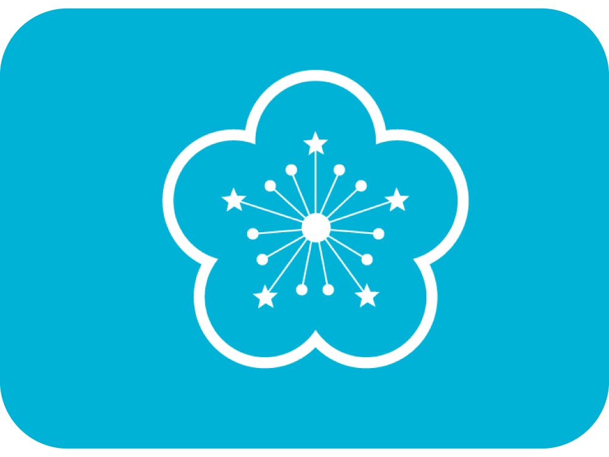
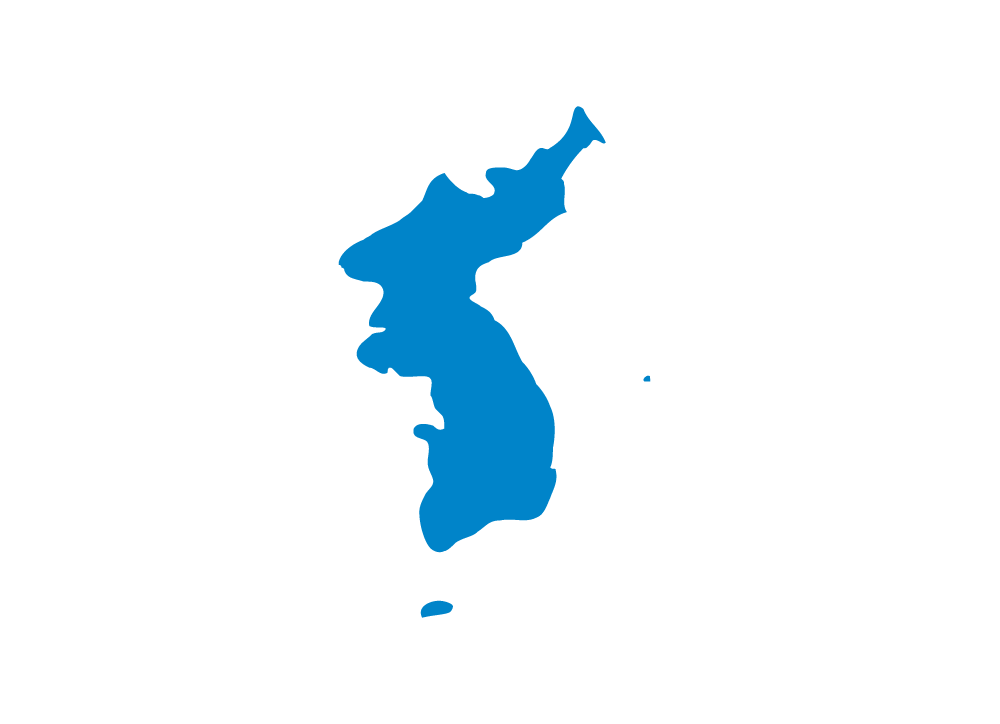
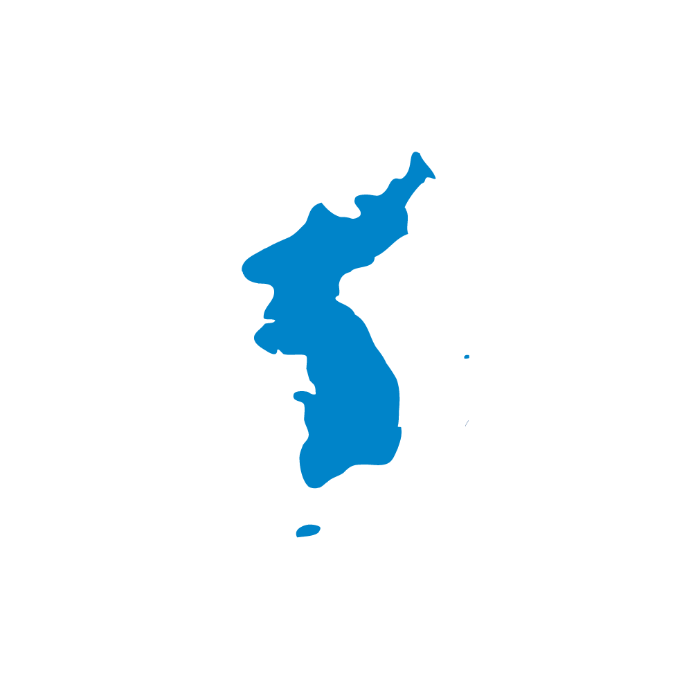

# Emoji Completion Project - Emoji补全计划

&nbsp;&nbsp;

| Name | Code | Code | Twemoji | EmojiOne |
|:-:|:-:|:-:|:-:|:-:|
| - | 增加 | - | Add | - |
| 苏联 苏维埃社会主义 共和国联盟 | `🇸` `🇺` | `1f1f8` `1f1fa` |  |  |
| 新义州 特别行政区 | `🇸` `🇳` `🇯` | `1f1f0` `1f1f5` `1f1f8` `1f1f3` `1f1ef` |  |  |
| - | Substitute | - | 替换 | - |
| 台湾 | `🇹` `🇼` | `1f1f9` `1f1fc` |  |  |
| 台湾 特别行政区 | `🇹` `🇼` | `1f1f9` `1f1fc` |  |  |
| 朝鲜半岛 | `🇰` `🇷` `🇰` `🇵` | `1f1f9` `1f1fc` `1F1F0` `1F1F5` |  |  |
